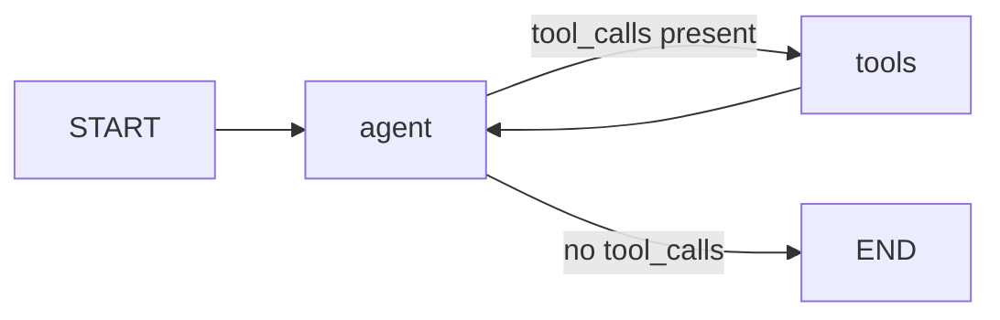

# Orchestration — LangGraph StateGraph

MedNexus AI uses **LangGraph** to implement each specialist agent as a stateful, cyclic graph. This section explains how the orchestration layer works, from message routing to response streaming.

---

## Why LangGraph?

Traditional linear chains (LangChain `RunnableSequence`, `LLMChain`) cannot model the "think → use tool → re-evaluate → respond" reasoning loop. LangGraph allows:

- **Cyclic execution**: The agent can call tools multiple times before generating a final answer.
- **Conditional routing**: The `tools_condition` edge routes the LLM output to either a tool call or the `END` node.
- **Persistent state**: `SqliteSaver` checkpoints the full message history between HTTP requests, enabling multi-turn conversations with no in-memory session.

---

## Graph Structure



### Nodes

| Node | Function | Description |
|---|---|---|
| `agent` | `call_model(state)` | Passes the full message history to the LLM. Returns the model's response (may include tool_call objects). |
| `tools` | `ToolNode(tools_list)` | Executes the tool(s) requested by the LLM and appends `ToolMessage` results to state. |

### Edges

| Edge | Type | Condition |
|---|---|---|
| `START → agent` | Static | Always starts with the agent node. |
| `agent → tools` | Conditional | `tools_condition` returns `"tools"` if the LLM response contains tool calls. |
| `agent → END` | Conditional | `tools_condition` returns `END` if the LLM produces a final text response. |
| `tools → agent` | Static | Tool results always feed back to the agent for synthesis. |

---

## State Schema

All agents use `MessagesState`:

```python
from langgraph.graph import MessagesState

# MessagesState is equivalent to:
class MessagesState(TypedDict):
    messages: Annotated[list[AnyMessage], add_messages]
```

Messages accumulate as a flat list of alternating `HumanMessage`, `AIMessage`, and `ToolMessage` objects.

---

## Checkpointing (Session Persistence)

```python
import sqlite3
from langgraph.checkpoint.sqlite import SqliteSaver

conn = sqlite3.connect("dermatologist.db", check_same_thread=False)
checkpointer = SqliteSaver(conn)
compiled_graph = graph.compile(checkpointer=checkpointer)
```

| Detail | Value |
|---|---|
| Storage backend | SQLite (one `.db` file per specialist) |
| Session key | `thread_id` (UUID sent by the frontend per browser tab) |
| Thread safety | `check_same_thread=False` — required for Flask multi-threading |

Every call to `compiled_graph.stream(...)` passes a config dict with the `thread_id`:

```python
config = {"configurable": {"thread_id": thread_id}}
for chunk in compiled_graph.stream({"messages": [HumanMessage(content)]}, config):
    ...
```

LangGraph automatically loads the prior state for that `thread_id` from SQLite and appends the new messages.

---

## Streaming (SSE)

The Flask route `/chat` (POST) uses Python's `yield` generator inside a `Response(stream_with_context(...), mimetype="text/event-stream")` wrapper. The LangGraph `.stream()` call produces chunks; each chunk containing new `AIMessage` content tokens is sent as an SSE `data:` event.

```python
def generate():
    for chunk in graph.stream(input, config, stream_mode="messages"):
        token = chunk[0].content
        yield f"data: {token}\n\n"

return Response(stream_with_context(generate()), mimetype="text/event-stream")
```

The frontend JavaScript in each `static/js/<specialist>.js` reads these events via `EventSource` and appends tokens to the message bubble in real time.

---

## Thread Management

- **New Thread**: A new `thread_id` (UUID) is generated by the frontend on page load or when the user clicks "New Chat."
- **List Threads**: `GET /threads` returns all `thread_id` values and their first message from SQLite, enabling the sidebar conversation history panel.
- **Restore Thread**: Selecting a past thread sends its `thread_id` in subsequent `/chat` requests; LangGraph reloads the full prior state automatically.
- **Edit Message**: `POST /edit` truncates the SQLite checkpoint to a given message index, allowing users to branch from an earlier point in the conversation.
