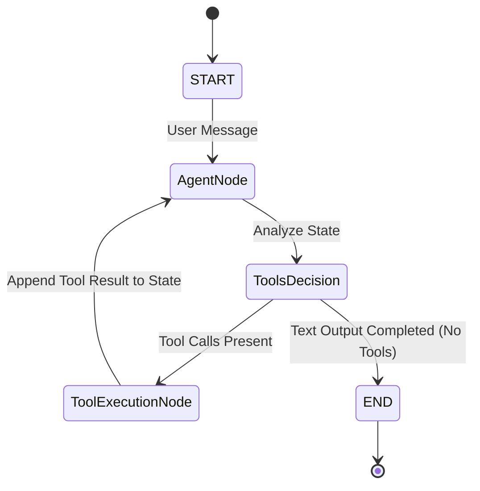

# LangGraph Orchestration & Memory

MedNexus AI uses **LangGraph** to model multi-turn consultations as stateful, cyclic directed graphs.

---

## Agent Reasoning Cycle

Unlike linear chains (which execute from input to output in a single pass), each specialist agent runs inside a dynamic reasoning loop:



### Graph Components

*   **`AgentNode`**: Passes the current list of messages (including system guidelines and tool feedback) to the LLM. Returns an `AIMessage` containing either text content or requested tool parameters.
*   **`ToolsDecision` (`tools_condition`)**: A conditional router that inspects the LLM's response. If the model generates a `tool_calls` request, the execution routes to `ToolExecutionNode`. Otherwise, it routes to `END`.
*   **`ToolExecutionNode` (`ToolNode`)**: Executes the python tool requested by the agent (e.g. searching Pinecone, querying Tavily, or calling Moondream VLM) and appends a `ToolMessage` back into the graph's messages list.

---

## Session Persistence & Checkpointing

Flask is inherently stateless. To maintain context across multiple user message requests, MedNexus AI uses `SqliteSaver` checkpointers to write LangGraph states to SQLite:

```python
from langgraph.checkpoint.sqlite import SqliteSaver

conn = sqlite3.connect("dermatologist.db", check_same_thread=False)
checkpointer = SqliteSaver(conn)
chatbot_compiled = graph.compile(checkpointer=checkpointer)
```

*   **Config key**: Each request passes a `thread_id` (prepended with the active user ID, e.g. `user_1_thread-uuid`) inside the config object.
*   **Restore**: LangGraph automatically retrieves prior message checkpoints from SQLite, executes the graph with the new `HumanMessage`, and saves the updated state.
*   **Thread Safety**: Setting `check_same_thread=False` allows multi-threaded Flask requests to safely query the SQLite database concurrently.

---

## Context Windowing ("Sandwich Window")

Over long conversations, the message list can exceed the LLM's context limit or consume too many tokens. To resolve this, each agent employs a custom **Sandwich Windowing** function (`filter_messages`) before invoking the model:

1.  **Retain Intake Phase**: The first **15 messages** are kept. This preserves the initial intake details (the patient's name, age, gender, and primary symptoms).
2.  **Prune Intermediate History**: If the history exceeds **40 messages**, intermediate conversation blocks are pruned.
3.  **Insert Marker**: A `SystemMessage` is placed at the boundary to warn the agent: `[SYSTEM NOTE: X middle messages have been condensed to save memory...]`.
4.  **Retain Active Context**: The last **25 messages** are kept, preserving the active conversational flow.
5.  **Report Content Pruning**: Any `ToolMessage` containing massive generated HTML reports (from `generate_medical_report` or `generate_pharmacy_report`) is replaced by a placeholder (`[Medical Report Generated Successfully - Full HTML content hidden to save tokens]`) when feeding history back to the LLM.
