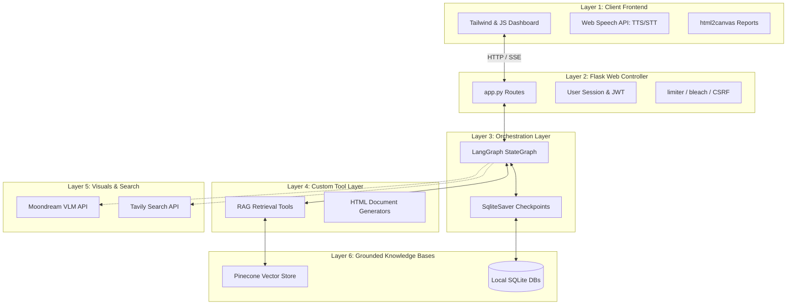

# Architecture Overview

MedNexus AI separates medical specialties into independent software agents rather than relying on a single, generalized healthcare chatbot. This mitigates hallucination risk by enforcing domain constraints and distinct knowledge boundaries.

---

## The 6-Layer Architecture

The system is structured into six functional layers:

### Layer Details

1.  **Layer 1: Client Frontend**: A mobile-first interactive dashboard built with Tailwind CSS, Vanilla JS, and Markdown-it. Handles speech dictation via Web Speech API and client-side download of visual prescriptions via `html2canvas`.
2.  **Layer 2: Flask Web Controller**: Manages routing, user endpoints, Google OAuth2 integration, and streams responses incrementally via Server-Sent Events (SSE). Includes inputs sanitation (bleach) and security configurations (limiter and CSRF).
3.  **Layer 3: Orchestration Layer**: Powered by LangGraph, this layer implements cyclic reasoning loops. The state history is preserved across HTTP requests using SQLite database checkpointers.
4.  **Layer 4: Custom Tool Layer**: Code functions decorated with `@tool` that interface between the LLM agent and external databases. These include retrieval tools, web searches, vision models, and HTML file builders.
5.  **Layer 5: Visuals & Search**: Multi-modal vision processing via Moondream and live web query execution via Tavily.
6.  **Layer 6: Grounded Knowledge Bases**: Consists of the Pinecone vector index (embedded using `abhinand/MedEmbed-base-v0.1` dimensions) and the local SQLite database files storing user details and agent checkpoints.
