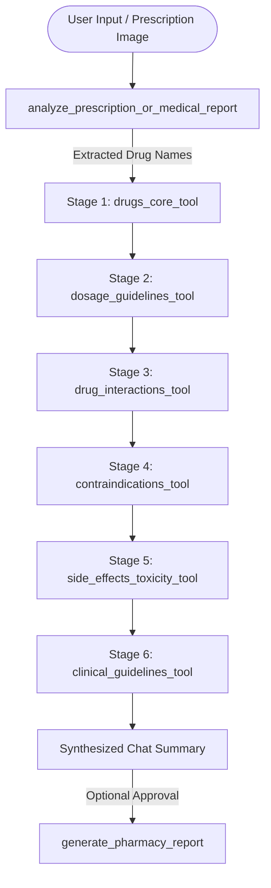

# Dr. Pharma Six-Stage RAG Pipeline

Dr. Pharma uses a specialized RAG pipeline to validate prescriptions. When the agent receives a request or an uploaded document, it calls six distinct verification tools in sequence before finalizing the response.

---

## Ingestion & Pipeline Sequence

---

## Detailed Pipeline Stages

All tools hit specific namespaces inside the `pharmacy` Pinecone index and use `process_pharmacy_clinical_search` for LLM synthesis.

### 1. Stage 1: Central Pharmacology (`drugs_core_tool`)
*   **Purpose**: Validates the drug identity, classifications, and primary mechanisms of action.
*   **Namespace**: `drugs_core`
*   **Input**: `query: str` (e.g. "Metformin hydrochloride mechanism")
*   **Output**: A concise text summary of pharmacological classifications.

### 2. Stage 2: Dosage Validation (`dosage_guidelines_tool`)
*   **Purpose**: Cross-references patient age/weight parameters with therapeutic dosage limits.
*   **Namespace**: `dosage_guidelines`
*   **Input**: `query: str` (e.g. "Amoxicillin pediatric dosage limits")
*   **Output**: Verification summary showing therapeutic ranges and toxicity margins.

### 3. Stage 3: Interaction Checker (`drug_interactions_tool`)
*   **Purpose**: Identifies potential drug-drug interactions when multiple medications are co-prescribed.
*   **Namespace**: `drug_interactions`
*   **Input**: `query: str` (e.g. "Warfarin and Aspirin interaction")
*   **Output**: Clinical interaction warnings and severity risk levels (Mild, Moderate, Severe).

### 4. Stage 4: Patient Contraindications (`contraindications_tool`)
*   **Purpose**: Cross-checks medications against patient conditions like pregnancy, kidney disease, liver impairment, or allergies.
*   **Namespace**: `contraindications`
*   **Input**: `query: str` (e.g. "Lisinopril in pregnancy")
*   **Output**: Clean contraindication alert summaries.

### 5. Stage 5: Toxicity & Side Effects (`side_effects_toxicity_tool`)
*   **Purpose**: Gathers adverse effects, toxicity indicators, and overdose symptoms.
*   **Namespace**: `side_effects_toxicity` (Queried using the secondary credentials: `PINECONE_API_KEY_PHRAMACY`).
*   **Input**: `query: str` (e.g. "Statin induced myalgia")
*   **Output**: Safety profiles listing common and rare adverse effects.

### 6. Stage 6: Protocol Audit (`clinical_guidelines_tool`)
*   **Purpose**: Verifies that the prescription matches standard clinical guidelines (e.g. NICE, Merck Manual).
*   **Namespace**: `clinical_guidelines` (Queried using the secondary credentials: `PINECONE_API_KEY_PHRAMACY`).
*   **Input**: `query: str` (e.g. "First-line therapy for type 2 diabetes")
*   **Output**: Compliance check summary.

---

## Report Generation Flow

Once all six validation tools complete, Dr. Pharma outputs a concise, structured chat summary outlining findings. The agent then asks:

> "I have finished my clinical analysis. Would you like me to generate your high-fidelity Pharmaceutical Analysis Report now?"

If the user approves (inputs "Yes", "Approved", or similar), the agent invokes `generate_pharmacy_report` to generate the HTML report.
