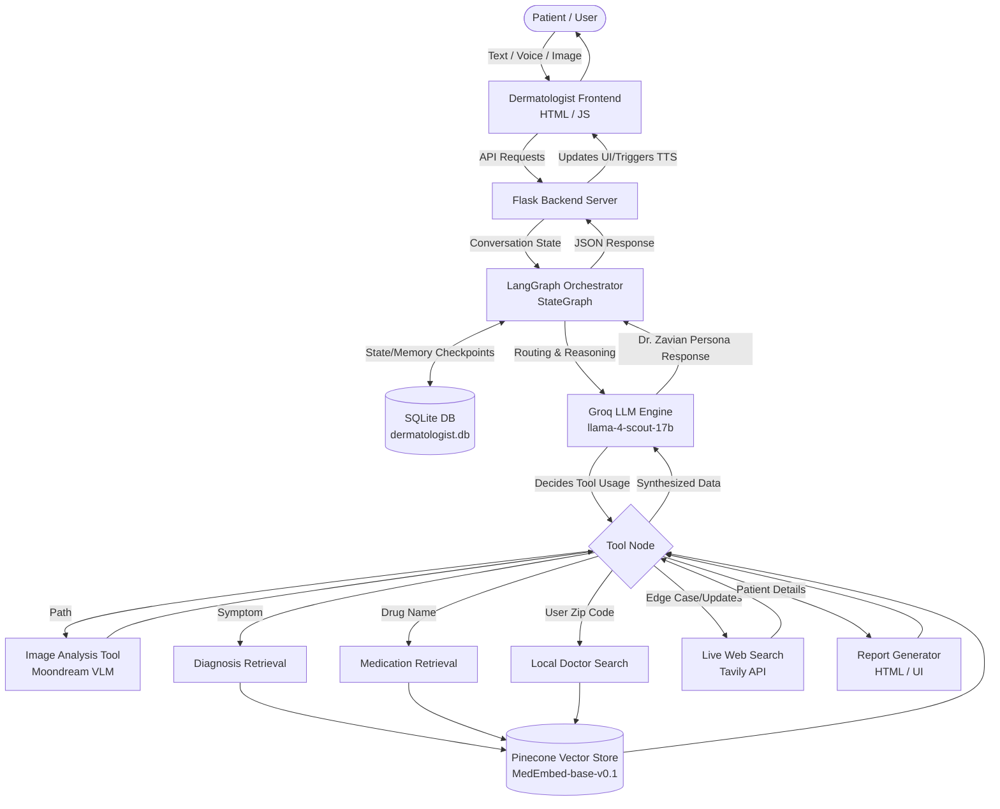

# RESEARCH DATA & DRAFT: MedNexus AI

**Title**: MedNexus AI: A Multi-Agent System for Specialized Clinical Diagnostics and Automated Medical Reporting

**Authors**: [Insert Author Name(s)]
**Affiliation**: [Insert Institution Name]
**Date**: February 19, 2026

---

## Abstract
The rapid evolution of Large Language Models (LLMs) has advanced digital health, yet general-purpose AI commonly lacks the clinical rigor required for specialized medical fields, leading to potentially dangerous hallucinations. We present MedNexus AI, a specialized software ecosystem utilizing a multi-agent orchestrated architecture to provide expert-level consultation across multiple clinical domains, including **Dermatology, Otorhinolaryngology (ENT), Psychiatry, Pharmacy, and General Medicine**. By integrating Agentic AI workflows (LangGraph), domain-specific Retrieval-Augmented Generation (RAG) across clinical medical datasets, and multi-modal computer vision (Moondream), MedNexus AI enables automated symptom evaluation, visual lesion diagnosis, and the generation of structured clinical reports. Confining agents to strict clinical personas and real-time medical data retrieval ensures high diagnostic accuracy and presents a reproducible framework for clinical AI research. The software is released under the MIT License and available for research and development purposes.

**Keywords**: Medical AI, Multi-Agent System, Retrieval-Augmented Generation, LangGraph, Clinical Diagnostics, Telemedicine, Psychiatry AI, Pharmacy Automation

## 1. Introduction
Modern healthcare systems face challenges in accessibility and specialized resource allocation. Digital health assistants have emerged as a solution, but their utility is often limited by "hallucinations" and a lack of specialized knowledge. MedNexus AI addresses these limitations by partitioning medical expertise into dedicated, tool-augmented agents. This study documents the development of a "MedNexus AI" platform that replicates the consultation process of a specialist, from patient intake and history taking to clinical analysis and prescription generation.

## 2. System Architecture and Methodology

### 2.1 Multi-Agent Orchestration
The core of MedNexus AI is built on **LangGraph**, enabling directed acyclic graph (DAG) workflows. Unlike linear chatbots, MedNexus employs an "Agentic Loop" where the model can autonomously decide to pause, use a tool (such as a medical search or vector retrieval), and then refine its response based on the tool's findings.

### 2.2 Domain-Specific Retrieval-Augmented Generation (RAG)
To ensure clinical accuracy, we implemented a RAG pipeline using **Pinecone** vector databases and **HuggingFace MedEmbed** (`abhinand/MedEmbed-base-v0.1`) embeddings. The deployed pipeline retrieves the **top-5 most semantically similar chunks** (k=5) from the relevant namespace and feeds them to the LLM for synthesis into a clinical summary. The evaluation harness in `evaluation/` measures retrieval quality at k=5 using Precision@5, Recall@5, MRR, Hit Rate@5, and NDCG@5 metrics.

> **Note on evaluation vs. deployed pipeline:** The evaluation harness measures the raw retrieval stage (k=5 similarity search). The deployed application does not include an intermediate cross-encoder reranking step; the retrieved chunks are passed directly to the LLM for synthesis. This design keeps inference latency minimal in a real-time streaming context.

The knowledge base is segmented into namespaces:
- **Diagnosis Knowledge**: Contains clinical presentation and differential diagnosis nodes.
- **Medication Knowledge**: Pharmacological data including first-line protocols and contraindications.
- **Geo-Directory**: Localized data for doctor-patient referral integration.

### 2.3 Multi-Modal Clinical Analysis
The system incorporates **Moondream** vision models to analyze clinical photography. This allows for:
- **Dermatological Analysis**: Evaluating lesion morphology, distribution, and color.
- **ENT Assessment**: Transcribing lab reports and identifying inflammation in throat/ear photography.

## 3. Implementation and Features

### 3.1 Specialist Agent Design

The ecosystem comprises five agents, each constrained by a "Clinical Rigor" system prompt. **The four specialist agents** (Dermatology, ENT, Psychiatry, Pharmacy) run on **`meta-llama/llama-4-scout-17b-16e-instruct`** via the Groq inference API. **The General Physician triage agent** (Dr. Alara) runs on **`openai/gpt-oss-120b`** via the same API.

1. **Dr. Zavian (Dermatologist)** — `meta-llama/llama-4-scout-17b-16e-instruct`: Focused on skin morphology, lesions, and aesthetic health. Pinecone index: `dermatologist`.
2. **Dr. Anees (ENT Specialist)** — `meta-llama/llama-4-scout-17b-16e-instruct`: Optimized for sinus, hearing, and throat ailments. Pinecone index: `ent-specialist`.
3. **Dr. Aria (Psychiatrist)** — `meta-llama/llama-4-scout-17b-16e-instruct`: Specialized in mental health, emotional support, and mood tracking. Pinecone index: `psychiatrist-specialist`.
4. **Dr. Pharma (Pharmacist)** — `meta-llama/llama-4-scout-17b-16e-instruct`: Expert in pharmacology, dosage precision, and contraindication checks. Pinecone index: `pharmacy`.
5. **Dr. Alara (General Physician)** — `openai/gpt-oss-120b`: Serves as the primary triage point, conducting initial screenings and routing patients to the appropriate specialist. Route: `/consultation` and `/specialists/general/consult`. Database: `general.db`.

Each agent mandates step-by-step reasoning and prohibits assumptions without sufficient evidence. State persistence uses LangGraph's `SqliteSaver` checkpointing into per-specialist SQLite databases (`dermatologist.db`, `ent.db`, `psychiatrist.db`, `pharmacy_chats.db`, `general.db`).

### 3.2 HTTP API Endpoints
The deployed Flask application exposes the following routes (see `usage/api_reference.md` for full request/response details):

| Route | Method | Description |
|---|---|---|
| `/` | GET | Landing page |
| `/specialists` | GET | Specialists directory |
| `/signup` | GET, POST | User registration |
| `/login` | GET, POST | User authentication |
| `/logout` | GET | Session teardown |
| `/login/google` | GET | Google OAuth initiation |
| `/auth/callback` | GET | Google OAuth callback |
| `/specialists/derma/consult` | GET | Dermatologist UI |
| `/specialists/ent/consult` | GET | ENT UI |
| `/specialists/psych/consult` | GET | Psychiatrist UI |
| `/specialists/general/consult` | GET | General Physician UI (also `/consultation`) |
| `/specialists/pharmacy/consult` | GET | Pharmacist UI |
| `/threads` | GET | List conversation threads |
| `/history/<thread_id>` | GET | Fetch thread history |
| `/edit` | POST | Edit/truncate a past message |
| `/chat` | POST | Send message + receive SSE stream |

### 3.3 Automated Clinical Reporting
A significant contribution of this work is the automated generation of high-fidelity medical reports. Utilizing HTML5 and Tailwind CSS, the system converts chat data into a structured consultation report, including:
- Verified Physician Signatures.
- Clinical Notes and Formal Diagnoses.
- Professional Prescription (Rx) Tables.

### 3.4 Interactive User Experience
The frontend implements **Server-Sent Events (SSE)** for real-time streaming of AI tokens, mimicking natural speech patterns. Furthermore, the **Web Speech API** provides an inclusive "Auto-Speak" feature for visually impaired patients or hands-free operation in clinical environments.

### 3.5 Detailed Breakdown of the AI Dermatologist (Dr. Zavian)

The Dermatologist module is an advanced conversational and analytical medical chatbot engineered using **LangGraph** for workflow orchestration, connected to **`meta-llama/llama-4-scout-17b-16e-instruct`** via the ChatGroq API.

#### 3.5.1 Core Logic & AI Engine
*   **Orchestration Engine:** Built using **LangGraph** (via `StateGraph`), creating a cyclic workflow where the LLM can recursively think, utilize external tools, evaluate the results, and formulate the final short, empathetic, "WhatsApp-style" responses.
*   **Primary LLM Engine:** `meta-llama/llama-4-scout-17b-16e-instruct` via ChatGroq.
*   **Memory & State Persistence:** Short and long-term conversation buffers are maintained via LangGraph's `SqliteSaver` checkpointing, safely saving the conversation state into `dermatologist.db`. A "Sandwich Windowing" strategy retains the first 15 messages (intake phase) and the most recent 25 messages (active context), inserting a condensation marker for the pruned middle, keeping token consumption bounded.
*   **Embeddings Model:** `abhinand/MedEmbed-base-v0.1` via HuggingFace for semantic clinical vector retrieval.

#### 3.5.2 The Agentic Toolset
The AI has access to a dedicated Tool Node equipped with six major external tools:

1.  **`analyze_skin_or_report_image` (Vision Language Model)**: Visual diagnosis of user-uploaded skin conditions or reading uploaded clinical medical reports. Driven by the **Moondream** API.
2.  **`diagnosis_retrieval_tool` (RAG - Internal)**: Queries a specialized **Pinecone Vector Database** (index: `dermatologist`, namespace: `diagnosis_knowledge`) holding dermatological symptom-disease mappings. Retrieves top-5 chunks.
3.  **`medication_retrieval_tool` (RAG - Internal)**: Safe pharmacological matching for confirmed diseases, retrieving dosages, verifying first/second-line treatments, and checking contraindications. Retrieves top-5 chunks.
4.  **`doctor_search_tool` (RAG - Internal Directory)**: Finding local human dermatologists and skin clinics using the patient's zip code, querying the `dermatologists_geo_directory` namespace.
5.  **`search_tool` (Live Web Search - Tavily API)**: Acts as a dynamic fallback and real-time knowledge retrieval mechanism to bypass static knowledge cutoffs.
6.  **`generate_medical_report` (Content Generation)**: Compiles all diagnostics into a digital, downloadable HTML/Tailwind CSS medical prescription securely signed by "Dr. Zavian."

#### 3.5.3 Frontend Ecosystem
*   **Voice Interaction:** Built-in STT via `SpeechRecognition` API and TTS via `speechSynthesis` API.
*   **Image Processing:** Uploaded images are saved to `static/dermatalogist_upload/` and the path is passed to the backend for Moondream processing.

#### 3.5.4 Architectural Diagram

## 4. Discussion
The use of specialized agents reduces the noise found in general-purpose models. By binding specific tools (like `diagnosis_retrieval_tool`) to specific agents, we create a "Clinical Sandbox" where the AI is forced to reference validated medical data before responding. This significantly reduces the risk of incorrect drug dosages or erroneous diagnostic claims.

## 5. Conclusion
MedNexus AI represents a shift from "Chatbots" to "Clinical Agents." The integration of multi-modal vision, specialized RAG, and structured reporting provides a comprehensive platform that bridges the gap between patient discomfort and professional consultation. Future work will focus on expanding the specialist roster and integrating real-time EHR (Electronic Health Record) synchronization.

---

## 🏗️ Technical Appendices
- **Language Models (Specialists)**: `meta-llama/llama-4-scout-17b-16e-instruct` via Groq (Dermatology, ENT, Psychiatry, Pharmacy).
- **Language Model (GP Triage)**: `openai/gpt-oss-120b` via Groq (General Physician — Dr. Alara).
- **Embeddings**: `abhinand/MedEmbed-base-v0.1` via HuggingFace.
- **Backbone**: Python Flask, LangGraph.
- **Vector DB**: Pinecone (indexes: `dermatologist`, `ent-specialist`, `psychiatrist-specialist`, `pharmacy`).
- **Vision**: Moondream VL API.
- **UI/UX**: Clinical Glassmorphism Design System (HTML5, Vanilla CSS/JS, SSE streaming).
